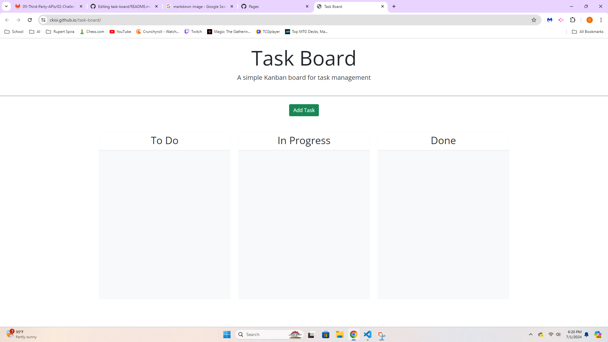
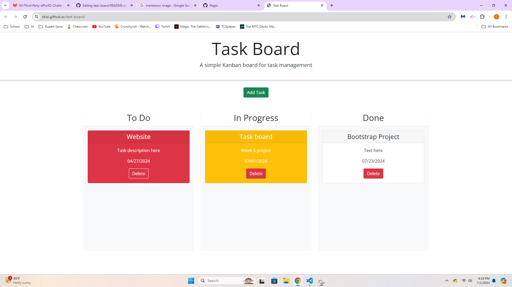

# Task Board

## Description
This is a task board for project team members. It can organize multiple tasks, as well as manage and track progress of tasks. It allows you to add your individual project tasks so that the overall project process is easier to manage.

## Usage
Clicking the add task button will allow you to add a task. Depending on when the task is due; it will be white (due in the future), yellow (due today), or red (already past due). You can drag the task cards to the columns depending on what their status is. When you drag a card to the done column, it will remove any warning colors if it had any. Clicking the delete button on a task will delete it. All tasks and their progress status are saved in local storage, so you can close the website without losing any information. 

## Technologies
HTML

CSS
- Bootstrap

JavaScript
- Jquery
- Jquery UI
- DayJS

## Links
https://ckisi.github.io/task-board/
https://github.com/ckisi/task-board
## Screenshots

## Credits
Xpert Learning Assistant
-For help with the delete tasks function and help with draggable functionality.
